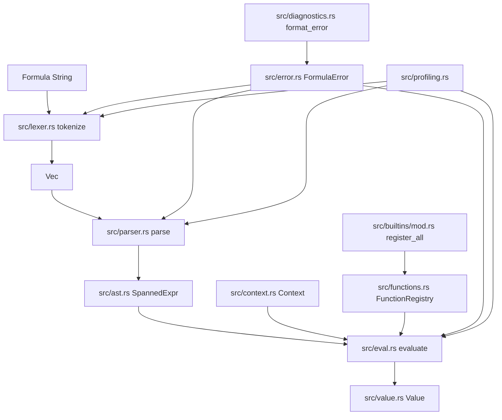
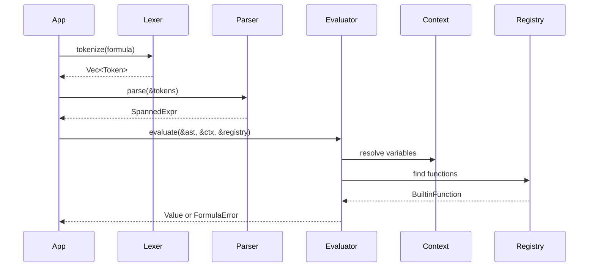

`formula_engine` is organized as a deliberately layered crate. The public entry point in `src/lib.rs` re-exports the high-traffic API, but the implementation remains split by responsibility: lexical analysis in `src/lexer.rs`, AST construction in `src/parser.rs` and `src/ast.rs`, evaluation in `src/eval.rs`, runtime state in `src/context.rs` and `src/value.rs`, extension points in `src/functions.rs` and `src/builtins`, and user-facing diagnostics in `src/error.rs`, `src/diagnostics.rs`, and `src/profiling.rs`.

## Module Relationships

## Request And Data Lifecycle

## Why The Crate Is Split This Way

### 1. Parsing and evaluation are independent on purpose

`src/lib.rs` exposes `tokenize`, `parse`, and `evaluate` as separate calls instead of hiding everything behind a single helper. That choice matters operationally: you can parse once, keep the `SpannedExpr`, and evaluate it many times with different contexts. The profiling utilities in `src/profiling.rs` also benefit from this split because they can measure each phase individually. In practical terms, it gives you a clean boundary between syntax validation and data-driven execution.

### 2. Runtime extensibility goes through a registry, not traits on the AST

Custom behavior is attached through `FunctionRegistry` in `src/functions.rs`. The evaluator in `src/eval.rs` resolves a `FunctionCall` node by name, validates the arity, evaluates every argument, and then invokes the stored function pointer. This keeps the AST simple and serializable-looking while making functions the primary extension point. It also means the language surface stays stable even when application teams add domain-specific operations.

### 3. Spans are carried through the syntax tree

`src/ast.rs` wraps each expression in `SpannedExpr`, whose `ExprMeta` stores a `Span`. The parser combines spans as it builds larger expressions, and errors across lexing, parsing, and evaluation can attach location data. That location data is later formatted in `src/diagnostics.rs` with the original source line and carets. The result is a much better failure mode than returning a plain string message without context.

### 4. The runtime is intentionally strict

The evaluator in `src/eval.rs` only accepts explicit type combinations. `+` works for `Number + Number` and `String + String`, comparisons are numeric, and boolean logic requires booleans. There is no coercion layer. That design reduces ambiguity and keeps user formulas predictable, but it does push more validation into the formula authoring step.

## How The Pieces Fit Together

The lexer turns raw text into `Token` values with exact `Span` data. `src/lexer.rs` handles operators, string escapes, identifiers, keywords like `true`, `false`, and `null`, and structural tokens for arrays and maps. It appends an `Eof` token at the end, which simplifies the parser.

The parser in `src/parser.rs` uses a standard recursive-descent structure with helper methods for operator precedence. `parse_left_associative_binary` centralizes the repeated pattern for `||`, `&&`, equality, comparison, term, and factor precedence levels. `parse_primary` then handles literals, grouped expressions, function calls, arrays, maps, and dot-separated identifiers such as `user.score`.

Evaluation walks the AST recursively in `src/eval.rs`. Literals return immediately. Variables resolve through `Context`, including traversal into nested `Value::Map` instances when a variable name contains dots. Function calls look up a `BuiltinFunction` in the registry, validate exact arity, evaluate arguments, and call the registered implementation. Arrays and maps evaluate their children eagerly into runtime `Value` containers.

Built-ins are kept in separate source files by domain. `src/builtins/mod.rs` centralizes registration so application code can opt into the full standard function set with one call. Profiling helpers in `src/profiling.rs` are deliberately outside the evaluation path; they reuse the public API rather than depending on internal hooks, which keeps the core runtime smaller and easier to reason about.

## Design Constraints You Should Know

- `if()` is implemented as a normal registered function in `src/builtins/logic.rs`, and the evaluator always evaluates function arguments before invocation. That means both branches are evaluated eagerly.
- `&&` and `||` are also eager in `src/eval.rs`; there is no short-circuit logic.
- Dot access is implemented as a split variable name lookup, not as a general property-access AST node. It works for `Context` variables backed by nested `Value::Map`, but not for arbitrary expression results.
- `date_diff()` in `src/builtins/date.rs` accepts three arguments, but the third `unit` argument is currently ignored even though the examples pass `"days"`.

These constraints are not accidental documentation details. They follow directly from the implementation, so they should shape how you design formulas and how you expose formula authoring to end users.
