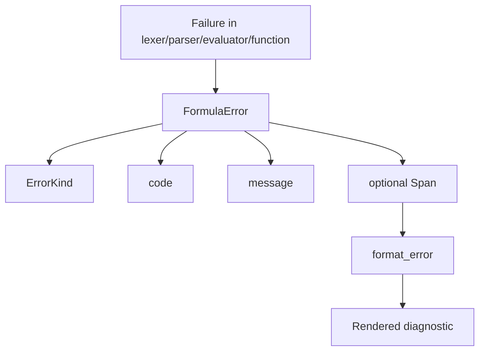

Error handling in `formula_engine` is intentionally structured, not ad hoc. The crate uses `FormulaError` from `src/error.rs` for lexing, parsing, evaluation, function, and context failures, and it preserves `Span` data wherever possible so callers can attach failures back to the original formula string.

## What This Concept Is

The error model consists of:

- `ErrorKind`, which classifies the failure.
- `FormulaError`, which carries `kind`, `code`, `message`, and optional `span`.
- `format_error`, which renders a line of source plus carets.
- Profiling helpers in `src/profiling.rs`, which are not errors themselves but are often used during debugging and formula review.

## Why It Exists

Formula systems usually fail in front of end users or configuration authors, not just developers. A raw `panic!` or generic `"invalid expression"` string is not enough when the formula was authored in a UI and stored in a database. The combination of error kind, machine-stable code, and source coordinates gives host applications something actionable to log, display, or translate.

## How It Works Internally

`src/error.rs` defines `ErrorKind` with six variants: `LexError`, `ParseError`, `EvalError`, `TypeError`, `FunctionError`, and `ContextError`. `FormulaError::new` constructs the error object, and the `Display` implementation renders it as `[CODE] message`.

`src/diagnostics.rs` takes the original source string plus a `FormulaError`. If the error contains a span, it extracts the source line and draws a caret underline at the error column range. That logic depends on `Span` and `Position` from `src/span.rs`.

`src/profiling.rs` complements this by helping you understand slow or complex formulas before they become operational problems. `profile_formula` measures average tokenization, parsing, and evaluation durations. `analyze_formula` inspects the AST and returns `OptimizationSuggestions` plus a coarse `FormulaComplexity`.



## How It Relates To Other Concepts

The [Execution Pipeline](/docs/execution-pipeline) produces the errors, the [Runtime Data Model](/docs/runtime-data-model) supplies span metadata, and the [Function System](/docs/function-registry) is responsible for returning meaningful errors from custom built-ins. If you expose formulas to users, this page is operationally as important as the API docs.

## Basic Usage: Render A User-Facing Diagnostic

```rust
use formula_engine::diagnostics::format_error;
use formula_engine::tokenize;

fn main() {
    let source = r#""unterminated"#;
    let err = tokenize(source).unwrap_err();
    let rendered = format_error(source, &err);

    println!("{rendered}");
}
```

Example output:

```text
[E101] ไม่พบเครื่องหมายปิดข้อความ
    1 | "unterminated
      | ^^^^^^^^^^^^^
```

## Advanced Usage: Match On Error Kind And Code

```rust
use formula_engine::builtins;
use formula_engine::error::ErrorKind;
use formula_engine::{evaluate, parse, tokenize, Context, FunctionRegistry};

fn main() {
    let mut registry = FunctionRegistry::new();
    builtins::register_all(&mut registry);

    let source = "missing_value + 1";
    let err = (|| {
        let tokens = tokenize(source)?;
        let ast = parse(&tokens)?;
        evaluate(&ast, &Context::new(), &registry)
    })()
    .unwrap_err();

    match err.kind {
        ErrorKind::ContextError if err.code == "E601" => {
            println!("Undefined variable: {}", err.message);
        }
        _ => {
            println!("Unhandled formula failure: {err}");
        }
    }
}
```

<Callout type="warn">Many built-in and evaluator messages in the current source are written in Thai, while a few date-related messages are in English. If your product needs fully localized output, treat `code` and `kind` as the stable integration points and translate or map the message yourself before showing it to users.</Callout>

## Trade-Offs

<Accordions>
<Accordion title="Why error codes are valuable even when messages already exist">
The message field is descriptive, but message text is a poor long-term integration contract because it can be reworded, localized, or made more detailed over time. The crate’s explicit codes such as `E101`, `E601`, `E401`, and `E503` are much better for automated handling in applications that store formulas or surface validation hints in a UI. This is especially useful because some messages are Thai and some are English. If you need stable machine behavior, branch on `kind` and `code`, then use `message` only as a fallback display string.
</Accordion>
<Accordion title="Why spans are optional instead of mandatory">
Not every failure naturally points to a source slice. Some function implementations return `FormulaError` with `None` spans because the failure occurs after argument evaluation and without direct knowledge of the original token positions. Keeping spans optional allows the crate to preserve location information where available without forcing awkward plumbing into every built-in. The trade-off is that host applications need to handle both cases gracefully: render source carets when a span exists, and show a plain structured error when it does not.
</Accordion>
</Accordions>

For exact signatures, see [Diagnostics, Errors, and Profiling](/docs/api-reference/diagnostics-and-profiling).
