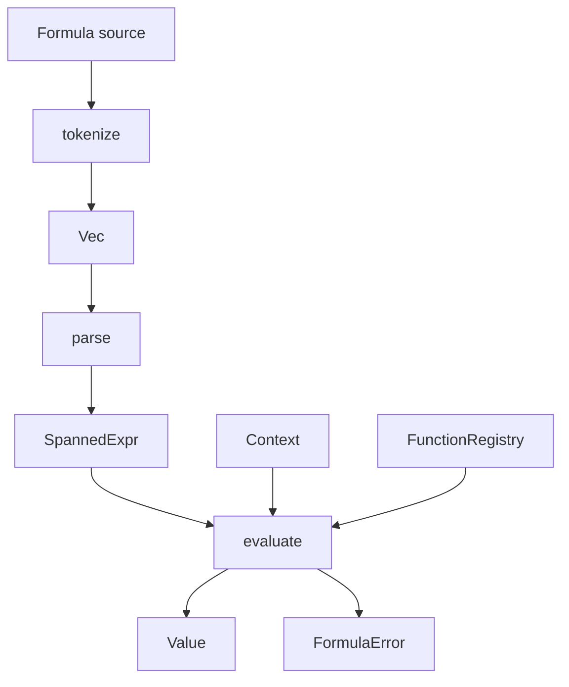

The execution pipeline is the heart of `formula_engine`. Every formula moves through three explicit stages exposed from the crate root: `tokenize`, `parse`, and `evaluate`. This is not just API style. It mirrors the implementation split across `src/lexer.rs`, `src/parser.rs`, and `src/eval.rs`, and it gives you useful control over caching, validation, and error reporting.

## What This Concept Is

The pipeline converts untrusted or user-authored source text into a typed runtime result. The lexer produces `Token` values with spans, the parser turns those tokens into `SpannedExpr` nodes, and the evaluator reduces the AST into a `Value` using a `Context` and `FunctionRegistry`. If you understand this sequence, you understand where to validate syntax, where to attach diagnostics, and where runtime data enters the system.

## Why It Exists

Separating the stages solves three practical problems:

- It lets you reject malformed formulas before touching application data.
- It allows AST reuse when the same formula is evaluated repeatedly.
- It gives each stage a precise error boundary with location information.

## How It Works Internally

`src/lexer.rs` scans the source string character by character. It recognizes numbers, strings, identifiers, keywords, operators, and structural characters like `[` and `{`. Each emitted `Token` includes a `TokenKind`, a `lexeme`, and a `Span`.

`src/parser.rs` consumes the token stream with a recursive-descent parser. The precedence ladder is encoded in `parse_logical_or`, `parse_logical_and`, `parse_equality`, `parse_comparison`, `parse_term`, `parse_factor`, and `parse_unary`. The helper `parse_left_associative_binary` is the reason the implementation stays compact while still honoring precedence correctly. `parse_primary` handles arrays, maps, grouped expressions, literals, variables, and function calls.

`src/eval.rs` recursively evaluates the AST. Variables are read from `Context`, functions are found through `FunctionRegistry`, arrays and maps are evaluated into `Value::Array` and `Value::Map`, and binary or unary operators perform strict type checks. Evaluation errors return `FormulaError` with codes like `E005` for missing variables or `E006` for type issues.



## How It Relates To Other Concepts

The pipeline depends on the [Runtime Data Model](/docs/runtime-data-model) because values, spans, and AST nodes define what can be represented at runtime. It also depends on the [Function System](/docs/function-registry) because function calls are resolved during evaluation. When something fails, the [Error Reporting](/docs/error-reporting) model determines what you can show to users.

## Basic Usage

```rust
use formula_engine::builtins;
use formula_engine::{evaluate, parse, tokenize, Context, FunctionRegistry};

fn main() -> Result<(), Box<dyn std::error::Error>> {
    let mut registry = FunctionRegistry::new();
    builtins::register_all(&mut registry);

    let tokens = tokenize("1 + 2 * 3")?;
    let ast = parse(&tokens)?;
    let result = evaluate(&ast, &Context::new(), &registry)?;

    assert_eq!(format!("{result:?}"), "Number(7.0)");
    Ok(())
}
```

## Advanced Usage: Parse Once, Evaluate Many Times

Because parsing and evaluation are separate, you can amortize parse cost for repeated execution.

```rust
use formula_engine::builtins;
use formula_engine::{evaluate, parse, tokenize, Context, FunctionRegistry, Value};

fn main() -> Result<(), Box<dyn std::error::Error>> {
    let mut registry = FunctionRegistry::new();
    builtins::register_all(&mut registry);

    let tokens = tokenize("score + bonus")?;
    let ast = parse(&tokens)?;

    let mut a = Context::new();
    a.set("score", Value::Number(80.0));
    a.set("bonus", Value::Number(5.0));

    let mut b = Context::new();
    b.set("score", Value::Number(92.0));
    b.set("bonus", Value::Number(3.0));

    let first = evaluate(&ast, &a, &registry)?;
    let second = evaluate(&ast, &b, &registry)?;

    assert_eq!(format!("{first:?}"), "Number(85.0)");
    assert_eq!(format!("{second:?}"), "Number(95.0)");
    Ok(())
}
```

<Callout type="warn">`evaluate` is eager. In `src/eval.rs`, binary operators evaluate both sides before applying the operator, and function calls evaluate every argument before calling the registered function. That means `if(cond, a, b)` computes both `a` and `b`, and `&&` or `||` do not short-circuit.</Callout>

## Common Trade-Offs

<Accordions>
<Accordion title="Why the crate exposes three functions instead of one helper">
The public split between `tokenize`, `parse`, and `evaluate` creates a slightly more verbose call site, but it buys you explicit control over when each phase runs. That matters if formulas are user-authored and should be syntax-checked once at save time, then evaluated many times later. It also improves profiling because `src/profiling.rs` can measure the phases independently instead of treating execution as a black box. If you want a one-call helper in your application, build it on top of the public API after deciding whether AST caching matters for your workload.
</Accordion>
<Accordion title="Why the parser uses recursive descent instead of a generated grammar">
The parser in `src/parser.rs` is straightforward to inspect and extend, especially for a language with a small fixed precedence ladder. Adding support for arrays, maps, and function calls only required changes in `parse_primary`, plus token support in the lexer. The trade-off is that some language features, such as general property access or lazy control-flow nodes, require structural AST changes rather than small grammar tweaks. For this crate’s scope, the directness of hand-written parsing is a good fit because the implementation remains compact and understandable.
</Accordion>
</Accordions>

Once you are comfortable with the pipeline, move to the [Function System](/docs/function-registry) to understand how formulas reach application-specific behavior, or jump to the [API Reference](/docs/api-reference/syntax-and-evaluation) for full signatures.
